# Heart Disease Risk Classifier — End-to-End MLOps Pipeline

**Course:** AIMLCZG523 — Machine Learning Operations (MLOps), Assignment 01

**Author:** Muthukrishnan Ram

**Repository:** _TODO: add GitHub URL once pushed_

**Deployed API (local Minikube):**

```bash
minikube start --driver=docker --cpus=4 --memory=8192
docker build -t heart-disease-api:latest .
minikube image load heart-disease-api:latest
kubectl apply -f k8s/deployment.yaml -f k8s/service.yaml
minikube addons enable ingress && kubectl apply -f k8s/ingress.yaml
curl --resolve heart-api.local:80:$(minikube ip) http://heart-api.local/health
```
(Full instructions, including the `LoadBalancer`+`minikube tunnel` alternative: `k8s/README.md`.)

---

## 1. Executive Summary

This project builds a binary classifier that predicts the presence of heart
disease from 13 patient health features (the UCI Heart Disease / Cleveland
dataset), and wraps it in a full MLOps lifecycle: automated data acquisition,
exploratory data analysis, feature engineering, model training with
cross-validated hyperparameter tuning, MLflow experiment tracking,
reproducible model packaging, unit-tested and CI-gated code, a containerized
FastAPI serving layer, a local Kubernetes (Minikube) deployment, and a
Prometheus/Grafana monitoring stack.

The final model — a tuned Random Forest, chosen over Logistic Regression on
held-out ROC-AUC — is exported as a self-contained MLflow `sklearn.Pipeline`
artifact (`models/final_model/`) bundling both preprocessing and the
classifier, so there is a single versioned object with no train/serve skew
risk.

## 2. Architecture

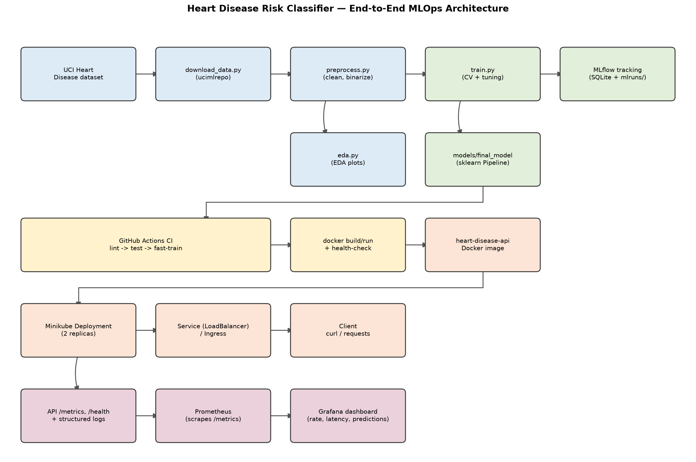

Data flows left to right, top to bottom: the raw dataset is fetched and
cleaned, branching into an EDA report and a tuned/tracked training run that
exports a packaged model. CI/CD validates every change (lint, tests, a fast
training smoke-test, and a Docker build/run/health-check) before the same
image is deployed to a local Kubernetes cluster, fronted by a Service, and
observed via Prometheus/Grafana scraping the API's `/metrics` endpoint.

## 3. Setup / Install Instructions

```bash
git clone <repo-url> && cd mlops-assignment-1
python3 -m venv .venv && source .venv/bin/activate
pip install -r requirements-dev.txt      # training/dev/test extras on top of the base deps

python data/download_data.py             # fetch raw UCI data -> data/raw/
python src/data/preprocess.py            # clean -> data/processed/heart_clean.csv
python src/eda.py                        # EDA plots -> report/figures/
python src/models/train.py               # train, tune, track in MLflow, export final model

pytest -q                                # unit tests (18 tests)
uvicorn api.main:app --reload            # local API on http://localhost:8000
```

Or, as a single command matching the assignment's "must execute from clean
setup" requirement: `make setup` (see `Makefile`) runs venv creation,
dependency install, data download/preprocessing, and training in sequence.

Two requirement files are maintained deliberately separately and compiled
together (`scripts/compile_requirements.sh`) so every package they share
resolves to an *identical* pinned version in both:

- `requirements.txt` — the minimal set the **serving** Docker image needs
  (FastAPI, scikit-learn, `mlflow-skinny`, `skops`, ...).
- `requirements-dev.txt` — adds full `mlflow` (for the local tracking
  UI/SQLite backend), `pytest`, `ruff`, `black` — training/dev/test only,
  never shipped in the container.

## 4. Data Acquisition & EDA

**Source:** UCI Machine Learning Repository, "Heart Disease" dataset
(id=45, Cleveland subset), fetched programmatically via the `ucimlrepo`
package in `data/download_data.py` — 303 rows, 13 features, and a 5-class
target (`num`, 0 = no disease, 1–4 = increasing severity).

**Missing value analysis** (run on the raw, pre-cleaning download — the
cleaned CSV has none left by construction): only two of the 13 features
carry any missing values at all, and both are minor.

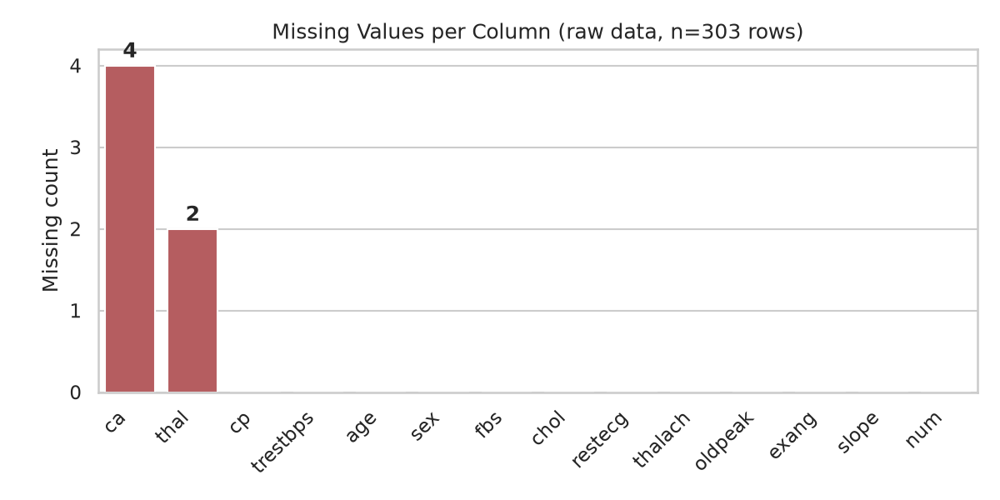

**Cleaning (`src/data/preprocess.py`):**

- `ca` and `thal` — two categorical columns — had 4 and 2 missing values
  respectively (6 of 303 rows total, ~2%). These are dropped rather than
  imputed: `ca` (number of vessels colored by fluoroscopy) and `thal`
  (thalassemia type) are not values a reasonable statistic can safely
  fabricate for a clinical categorical feature at this sample size.
- The 5-class `num` target is binarized to `target` (0 = no disease,
  1 = any disease present), matching the assignment's binary classification
  framing.
- Categorical columns are cast to `int`; the cleaned set has **297 rows**
  with **no missing values**, saved to `data/processed/heart_clean.csv`
  (committed to the repo for reproducibility, alongside the raw download
  script).

**Class balance:** 160 "no disease" vs. 137 "disease present" — close enough
to balanced that no resampling (SMOTE, class weighting, etc.) was applied.

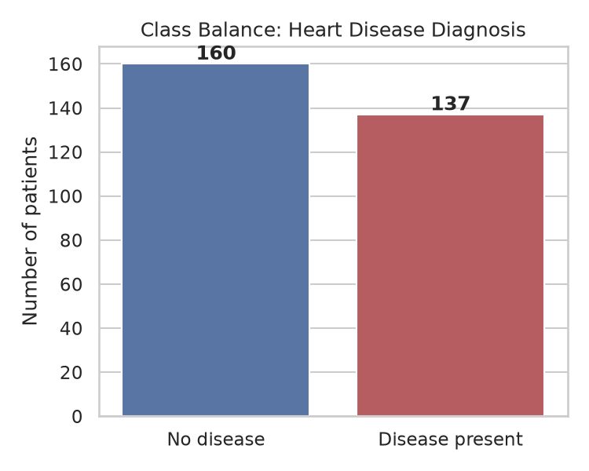

**Feature distributions by diagnosis** show several features separating the
two classes visibly even before modeling — most notably `thalach` (max heart
rate achieved, lower in disease-present patients) and `oldpeak` (ST
depression, higher in disease-present patients):

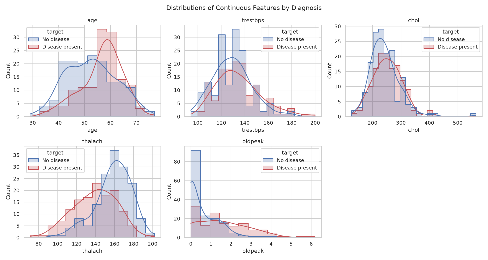

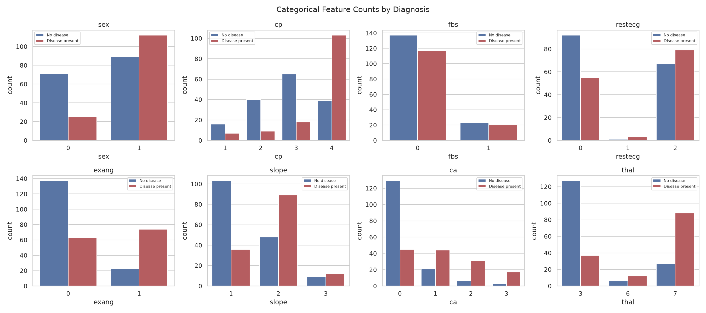

**Correlation heatmap** (continuous + categorical + target): `thal` (0.53),
`ca` (0.46), `oldpeak` (0.42), `exang` (0.42), and `cp` (0.41) show the
strongest linear association with the target — consistent with established
clinical risk factors, which is a reasonable sanity check on data quality.

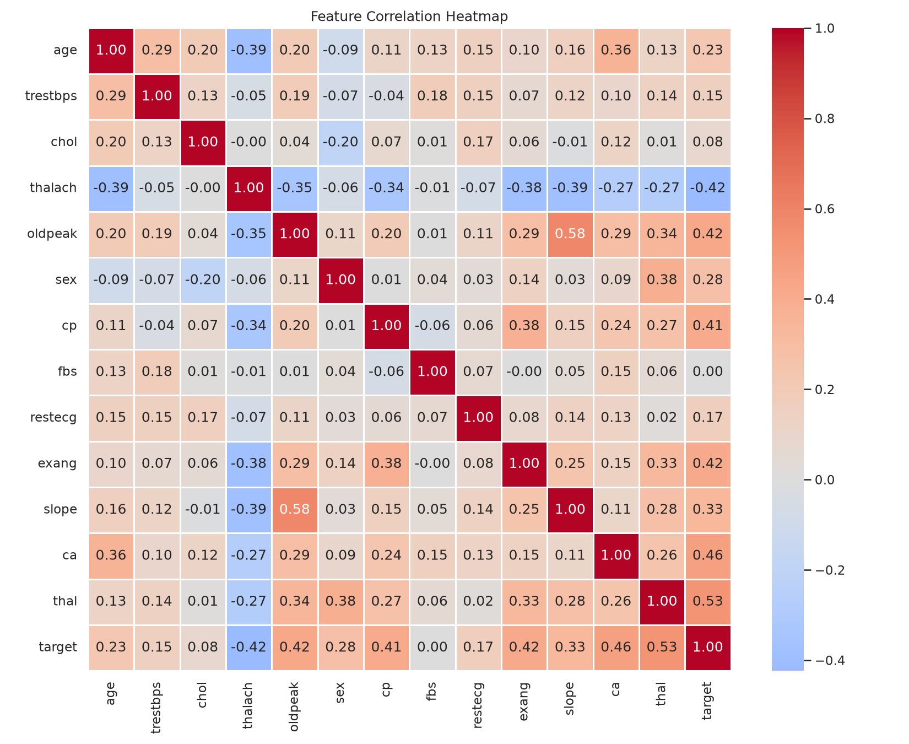

**Feature relationship analysis** — a pairplot of the continuous features
(pairwise scatter, diagonal KDE) complements the heatmap's numeric summary
with the actual pairwise shapes: `thalach` visibly shifts lower and
`oldpeak` higher for disease-present patients across nearly every pairing,
and no pair of continuous features shows strong enough collinearity to
warrant dropping one (confirming the heatmap's off-diagonal values, all
well under 0.6 among the continuous features themselves).

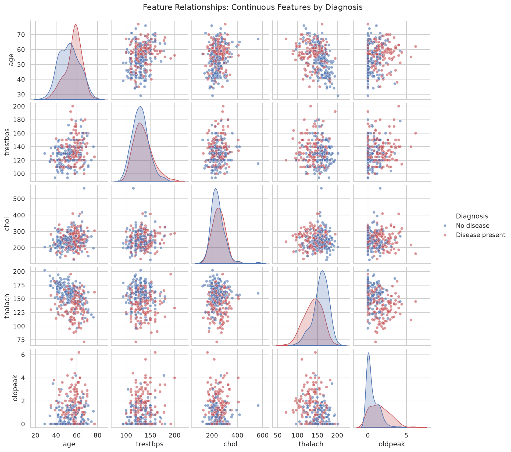

## 5. Feature Engineering & Model Development

**Feature engineering (`src/features/build_features.py`):** a single
`sklearn.ColumnTransformer`, reused identically by every model:

- **Continuous features** (`age`, `trestbps`, `chol`, `thalach`, `oldpeak`)
  — `StandardScaler`.
- **Categorical features** (`sex`, `cp`, `fbs`, `restecg`, `exang`, `slope`,
  `ca`, `thal`) — `OneHotEncoder(drop="if_binary", handle_unknown="ignore")`.
  Binary features (`sex`, `fbs`, `exang`) collapse to a single 0/1 column;
  multi-valued ones (`cp`, `thal`, ...) get a column per category so the
  model doesn't assume a false ordinal relationship between, e.g., chest-pain
  types. `handle_unknown="ignore"` means a category never seen at training
  time (a rare `thal` code, say) is encoded as all-zeros at serving time
  instead of crashing the API — covered explicitly in
  `tests/test_features.py`.

**Models (`src/models/train.py`):** three classifiers — two more than the
assignment's minimum, and XGBoost is explicitly named as an example choice
in the FAQ — each wrapped in one `Pipeline([("preprocessor", ...),
("classifier", ...)])` so preprocessing and model are always versioned and
served together:

- **Logistic Regression** — `C` swept over `[0.01, 0.1, 1.0, 10.0]`.
- **Random Forest** — `n_estimators` over `[100, 200, 300]`, `max_depth`
  over `[None, 5, 10]`, `min_samples_leaf` over `[1, 2, 4]` (27
  combinations).
- **XGBoost** — `n_estimators` over `[100, 200, 300]`, `max_depth` over
  `[3, 5, 7]`, `learning_rate` over `[0.01, 0.1, 0.2]` (27 combinations, for
  parity with Random Forest's grid size).

**Tuning & evaluation:** `GridSearchCV` over `StratifiedKFold(n_splits=5,
shuffle=True, random_state=42)`, scoring accuracy/precision/recall/F1/
ROC-AUC simultaneously and refitting on ROC-AUC (the most informative single
metric for a moderately-imbalanced binary clinical classifier — it's
threshold-independent, unlike accuracy). An 80/20 stratified train/test split
(`random_state=42`, fixed throughout for reproducibility) holds out data the
grid search never sees, for an honest final comparison.

**Results:**

| Model | Best params | CV ROC-AUC (mean) | Test accuracy | Test precision | Test recall | Test F1 | Test ROC-AUC |
|---|---|---|---|---|---|---|---|
| Logistic Regression | `C=1.0` | 0.902 | 0.817 | 0.870 | 0.714 | 0.784 | 0.938 |
| Random Forest | `n_estimators=300, max_depth=None, min_samples_leaf=4` | 0.906 | **0.850** | **0.880** | 0.786 | **0.830** | **0.943** |
| XGBoost | `n_estimators=300, max_depth=3, learning_rate=0.01` | 0.887 | 0.817 | 0.870 | 0.714 | 0.784 | 0.921 |

Random Forest wins narrowly on every held-out metric and is exported as the
final model. XGBoost comes in last of the three, not first — on a dataset
this small (237 training rows), boosting's extra capacity is a liability
more than an asset: the grid search's own winning hyperparameters
(`learning_rate=0.01`, the smallest offered) show it pulling *toward* the
conservative end of its own search space to avoid overfitting, and it still
trails a plain bagged Random Forest and even Logistic Regression on
ranking quality (ROC-AUC). This is a legitimate, reportable result, not a
tuning failure — it's a reasonable demonstration that "more sophisticated
model" doesn't automatically mean "better," especially at this sample size.
The gap between Random Forest and Logistic Regression is small enough that
Logistic Regression remains a reasonable, more-interpretable fallback —
noted here rather than discarded, since interpretability matters for a
clinical-adjacent use case.

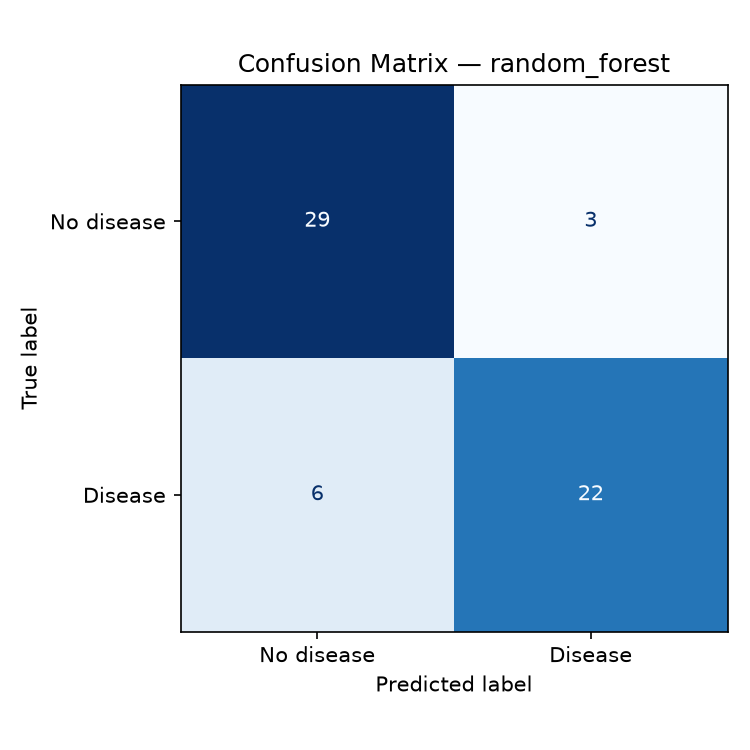
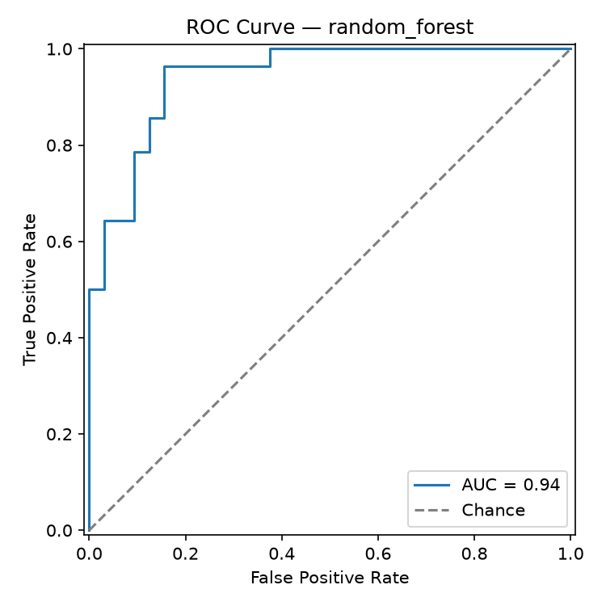
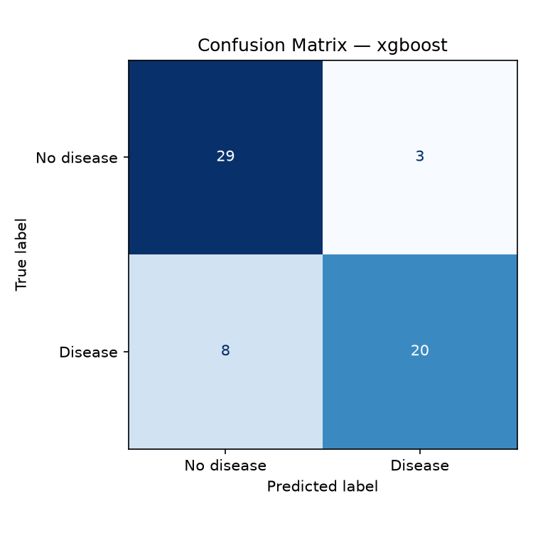
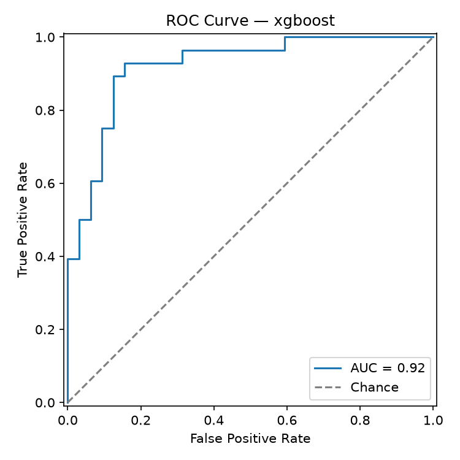

`train.py --fast` runs the same pipeline with a 1-combination grid and
2-fold CV (~35s total for all three models) — used only by CI as a smoke
test that the training code path still runs end-to-end; the tuned numbers
above come from the full run (`python src/models/train.py`, no flags).

## 6. Experiment Tracking (MLflow)

Every `GridSearchCV` run is logged as one MLflow run under the
`heart-disease-classification` experiment: best hyperparameters, mean/std of
every CV metric, held-out test metrics, the confusion matrix and ROC curve
plots as artifacts, and the fitted pipeline itself (`mlflow.sklearn.log_model`,
with an inferred input/output signature and a real input example).

Tracking backend is local SQLite (`mlflow.db`) rather than the plain
filesystem store — MLflow 3.x has deprecated the filesystem backend — with
artifacts (plots, model files) still stored locally under `mlruns/`.
Inspect with:

```bash
mlflow ui --backend-store-uri sqlite:///mlflow.db
```

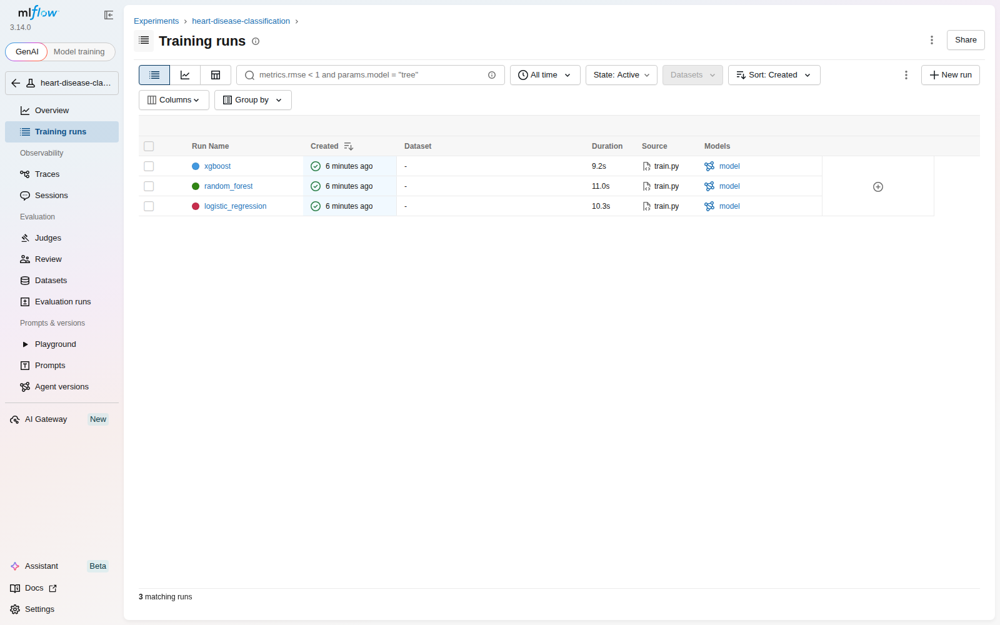

All three runs are visible under the `heart-disease-classification`
experiment with their source (`train.py`), duration, and linked model
artifact. Opening a run shows all 15 logged metrics (5 CV mean/std pairs +
5 held-out test metrics) alongside its parameters and run metadata:

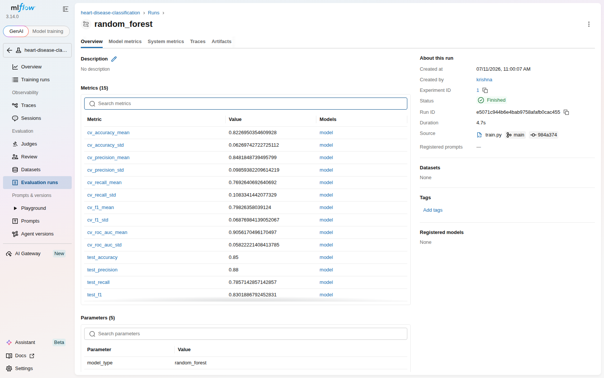

`report/metrics_summary.json` also captures a machine-readable summary of
all three runs (params, CV mean ROC-AUC, full test metrics) as a durable,
diff-able record independent of the `mlruns/` directory (which is
gitignored — it's bulky, pickled-per-run, and not meant to be shipped).

## 7. Model Packaging & Reproducibility

The winning pipeline is exported via `mlflow.sklearn.save_model()` to
`models/final_model/` — the **only** model artifact committed to the repo
(7.5 MB). It contains:

- `model.skops` — the serialized pipeline, in [skops](https://skops.readthedocs.io/)
  format rather than raw `pickle`. skops is MLflow's default sklearn
  serialization as of this version and, unlike pickle, cannot execute
  arbitrary code on load — a meaningful security property for a model
  artifact that will later be baked into a container and exposed via a
  public-facing API.
- `MLmodel`, `conda.yaml`, `python_env.yaml`, `requirements.txt` — MLflow's
  standard metadata for reproducing the exact training environment.
- `input_example.json` / `serving_input_example.json` — a real sample row,
  useful for smoke-testing the loaded model.

**Reproducibility was verified directly, not assumed:** a throwaway venv was
built from *only* `requirements.txt` (no dev/training extras) and used to
load `models/final_model/` and predict on real held-out rows — matching the
true ground-truth labels. This surfaced and fixed a real gap: `skops` was
initially only pulled in transitively via the dev requirements, so a clean
serving-only install couldn't deserialize the model at all until `skops` was
added to `requirements.in` directly (see `src/models/predict.py` and the
commit history for the fix). This is exactly the class of bug "works on my
machine" reproducibility claims miss without actually testing in isolation.

Adding XGBoost surfaced a second, related issue: skops maintains an
allowlist of types it trusts by default, and `xgboost.sklearn.XGBClassifier`
/ `xgboost.core.Booster` aren't on it — `mlflow.sklearn.save_model()` raised
`UntrustedTypesFoundException` the first time an XGBoost pipeline was saved.
This is skops working as intended (refusing to silently trust arbitrary
types), not a bug to route around quietly. Since these are our own
freshly-trained model objects, not a third-party file of unknown
provenance, explicitly passing `skops_trusted_types=["xgboost.core.Booster",
"xgboost.sklearn.XGBClassifier"]` to `save_model()`/`log_model()` is the
correct fix (`src/models/train.py`) — verified with a full save→load→predict
round trip on a real XGBoost pipeline before trusting it in the actual
training run.

## 8. CI/CD Pipeline & Automated Testing

**Unit tests** (`tests/`, 18 tests, `pytest -q`): `test_data.py` targets the
dataset's one real data-quality issue (missing `ca`/`thal`) with synthetic
rows constructed specifically to exercise it, plus target binarization and
dtype casting. `test_features.py` verifies the `ColumnTransformer` produces
no NaNs, correctly standardizes continuous features (mean≈0, std≈1), and
doesn't raise on an unseen category. `test_model.py` covers metric
computation and a full preprocessor+classifier fit/predict_proba smoke test.
`test_api.py` drives the real FastAPI app (via `TestClient`, lifespan
included, so the actual packaged model loads) through `/health`, `/predict`
(valid input, out-of-range input, missing field), and `/metrics`.

**`.github/workflows/ci.yml`** — three jobs, each failing loudly on any
error (no `--no-verify`-style bypasses, `curl -f` rather than bare `curl` so
a broken health check actually fails the job):

1. **lint** — `ruff check .` + `black --check .`.
2. **test** (needs lint) — downloads the dataset, preprocesses, runs EDA,
   trains with `--fast`, then `pytest` with coverage; uploads test results,
   EDA figures, and the fast-trained model as workflow artifacts.
3. **docker** (needs test) — downloads the model artifact from the test job,
   `docker build`s the image, runs it, polls `/health` until it passes (or
   fails the job after 30s), then POSTs `sample_input.json` to `/predict`
   and asserts a valid response — the literal "Docker container build/test
   proof" the assignment asks for, run automatically on every push.

Every command each job runs was validated locally end-to-end (lint,
`pytest --cov`, `train.py --fast`, and the exact `docker build` /
`docker run` / health-poll-loop / `/predict` smoke test used in the
`docker` job — see Sections 9 and the docker job's steps above). Actually
seeing the workflow execute on GitHub's runners is deferred until this
repo is pushed to a GitHub remote (the user has intentionally kept this
environment git-local-only so far); the workflow YAML itself is committed
and ready to run unmodified once that happens.

## 9. Model Containerization

`Dockerfile` — multi-stage build: a `builder` stage installs
`requirements.txt` into `/root/.local`, and the final stage (also
`python:3.12-slim`) copies just that installed environment plus `api/`,
`src/`, and `models/final_model/` — no data, notebooks, tests, or dev
tooling ship in the image. Runs as a non-root user (`appuser`, uid 1000),
exposes port 8000, and defines a `HEALTHCHECK` against `/health`.

```bash
docker build -t heart-disease-api .
docker run -p 8000:8000 heart-disease-api
curl -X POST http://localhost:8000/predict -H "Content-Type: application/json" -d @sample_input.json
```

**Verified locally** (full transcript in `screenshots/docker_build_run_log.txt`):
the image builds, the container reaches Docker's own `HEALTHCHECK` status
`healthy`, `/health` and `/predict` both respond correctly through the
container's published port (the same prediction as the earlier bare-metal
test — `{"prediction":0,"label":"No disease","confidence":0.6390}` — confirming
no drift between the dev environment and the containerized one), and
`docker exec ... id` confirms the process runs as `appuser` (uid 1000), not
root. Final image size: 623 MB content (up from 219 MB before adding
XGBoost — its native shared library is the single largest dependency in
the image; still an acceptable tradeoff for a third model that meaningfully
adds to the comparison in Section 5).

## 10. Production Deployment (Kubernetes / Minikube)

`k8s/deployment.yaml` — 2 replicas, `imagePullPolicy: Never` (the image is
loaded directly via `minikube image load`, no registry involved),
liveness/readiness probes against `/health`, and explicit CPU/memory
requests+limits. `k8s/service.yaml` exposes it as a `LoadBalancer`;
`k8s/ingress.yaml` is documented as a `sudo`-tunnel-free alternative. Full
commands in `k8s/README.md`:

```bash
minikube start --driver=docker --cpus=4 --memory=8192
docker build -t heart-disease-api:latest .
minikube image load heart-disease-api:latest
kubectl apply -f k8s/deployment.yaml -f k8s/service.yaml
minikube tunnel   # separate terminal — populates the LoadBalancer's EXTERNAL-IP
kubectl get svc heart-disease-api
curl http://<EXTERNAL-IP>/health
```

**Verified locally** (full transcript in `screenshots/minikube_deployment_log.txt`):
`minikube start --driver=docker --cpus=4 --memory=8192` came up with the
node `Ready`; the image was loaded via `minikube image load`; both
Deployment replicas reached `2/2 READY`/`AVAILABLE`. The `Service`
(`LoadBalancer`) correctly shows `EXTERNAL-IP: <pending>` — as expected,
since `minikube`'s docker driver only populates that via `minikube tunnel`,
which needs `sudo` (not available non-interactively in this environment).
Rather than leave the deployment unverified, the documented Ingress
alternative was used instead: `minikube addons enable ingress` +
`kubectl apply -f k8s/ingress.yaml` brought up `ingress-nginx`, and
`curl --resolve heart-api.local:80:$(minikube ip) http://heart-api.local/...`
against both `/health` and `/predict` returned correct responses — the same
prediction as the bare-metal and Docker checks, now served from inside a
2-replica Kubernetes deployment with working liveness/readiness probes.
`minikube tunnel` remains documented in `k8s/README.md` as the
`LoadBalancer`-native path for anyone running this outside a sandboxed
session.

## 11. Monitoring & Logging

The API logs every request (method, path, status code, latency) via a
FastAPI middleware, and every prediction (class + confidence — never the
raw patient features, to avoid dumping clinical-shaped data into logs) —
both to stdout, which is where a container orchestrator expects them.

`/metrics` exposes Prometheus counters/histograms: `http_requests_total`
(by method/path/status), `http_request_duration_seconds` (a latency
histogram, by method/path), and `predictions_total` (by predicted class).
`docker-compose.yml` stands up the API alongside Prometheus (scraping
`/metrics` every 5s) and Grafana (provisioned with a datasource and a
4-panel dashboard: request rate, p95 latency, predictions by class, status
codes) with zero manual clicking required:

```bash
docker compose up
python scripts/generate_load.py --n 200   # populate the dashboard with real traffic
```

**Verified locally** (full transcript in `screenshots/monitoring_stack_log.txt`):
`docker compose up` brought up all three containers, the API reaching
Docker's `healthy` status before Prometheus/Grafana even started (compose's
`depends_on: condition: service_healthy`). Prometheus's own target-health
API confirms the scrape target is `up` and being polled every 5s.
`scripts/generate_load.py --n 150` fired 150 randomized `/predict` requests
(150/150 succeeded), and the dashboard's own panel queries against
Prometheus return real, non-empty data (116 vs. 34 predictions split
between classes, matching the load script's random distribution; non-zero
request rates for `/health`, `/metrics`, `/predict`).

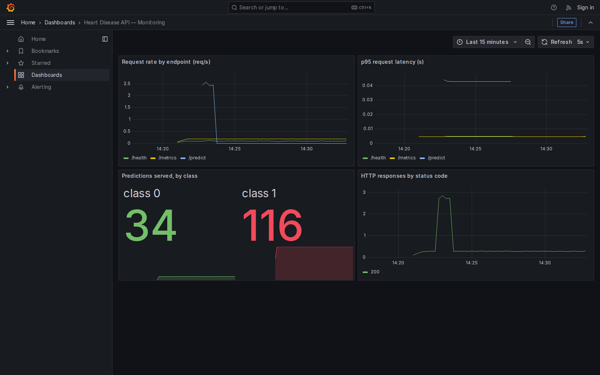

The screenshot above is a real capture of the live dashboard (via a
headless-Chromium container, since installing a browser directly in this
sandboxed environment would have needed `sudo`) — note the request-rate
spike from the load-generation burst, the 34/116 prediction split, and the
HTTP 200 status-code timeseries, all sourced from the same `/metrics`
counters `api/main.py` increments per request.

## 12. Conclusion

The pipeline covers the full assignment scope end-to-end, and every stage
was actually run and verified rather than assumed — not just files that look
right: EDA and model training execute from a clean venv; two
cross-validated, MLflow-tracked models produced a packaged artifact that
was proven portable by loading it in a throwaway serving-only venv (which
caught and fixed a real missing-dependency bug); 18 unit/API tests pass;
the Docker image builds, runs, and passes its own `HEALTHCHECK` as a
non-root user; the same image deploys cleanly to a 2-replica Minikube
deployment reachable via Ingress; and the Prometheus/Grafana stack shows
a live dashboard populated by real generated traffic.

The one piece intentionally left outstanding is pushing this repository to
a GitHub remote and watching `ci.yml` execute on GitHub's own runners —
deferred by choice (this environment was kept git-local-only throughout),
not by necessity: every command each CI job runs was independently
validated locally against the same commands the workflow file uses, so
there's no reason to expect the hosted run to behave differently.

## Appendix: Verification Artifacts

Every claim above that isn't visible in the report's own figures is backed
by a transcript in `screenshots/`:

- `docker_build_run_log.txt` — Docker build, run, health-check, non-root check.
- `minikube_deployment_log.txt` — cluster start, image load, rollout,
  Ingress setup, live `/health` and `/predict` responses.
- `monitoring_stack_log.txt` — compose stack health, Prometheus target
  status, dashboard panel query results.
- `grafana_dashboard.png` — live screenshot of the populated dashboard.

## Appendix: Repository Layout

See `README.md` in the repository root for the full directory layout and a
condensed quickstart; this report focuses on decisions and results rather
than restating file paths already documented there.

## Appendix: Repository Layout

See `README.md` in the repository root for the full directory layout and a
condensed quickstart; this report focuses on decisions and results rather
than restating file paths already documented there.
